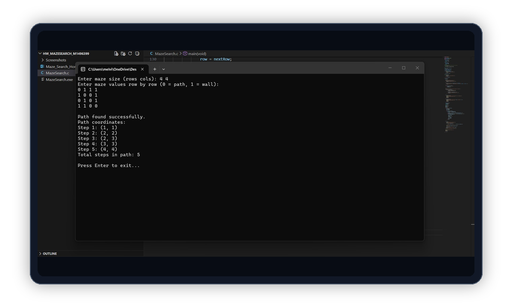

# Maze Search

Coursework project for Data Structures.

This project implements stack-based maze pathfinding in C. It supports 8-direction movement and reports whether a path exists through a user-provided maze.

## Preview



## Coursework Note

Built as an academic project to practice stack operations, 2D array traversal, and DFS-style pathfinding.

## Features

- Stack-based depth-first search
- 8-direction movement: N, NE, E, SE, S, SW, W, NW
- Boundary padding to simplify edge handling
- Visited-cell marking
- Input validation for maze size and cell values

## Tech Stack

- C
- Stack
- 2D arrays
- DFS-style pathfinding

## Build And Run

```bash
gcc MazeSearch.c -o MazeSearch
./MazeSearch
```

## Screenshots

| Input | Path found | No path |
| --- | --- | --- |
|  |  |  |
